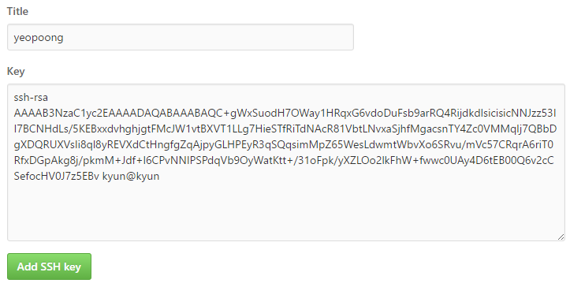

Git
===

Intro
-----

### 로컬저장소 구성
  * Working directory -> 작업트리
  * Index -> 스테이징
  * HEAD -> commit

기본명령어 
---------

### 환경설정

>$ git config --global --list 

### 저장소 생성

>$ git init 

>$ git clone git@github.com:yeopoong/yeopoong.github.io.git

### Indexing 

>$ git add finaname 

### Commit 

>$ git commit -m "commit message" 


원격저장소
---------

### 원격저장소 추가

>$ git remote add origin 저장소

### Pull 

>$ git pull origin master 

### Push 

>$ git push origin master 


GitHub
------

### New SSH key

SSH 키를 생성한다.
>$ ssh-keygen

```
Generating public/private rsa key pair.
Enter file in which to save the key (/c/Users/kyun/.ssh/id_rsa):
/c/Users/kyun/.ssh/id_rsa already exists.
Overwrite (y/n)? y
Enter passphrase (empty for no passphrase):
Enter same passphrase again:
Your identification has been saved in /c/Users/kyun/.ssh/id_rsa.
Your public key has been saved in /c/Users/kyun/.ssh/id_rsa.pub.
The key fingerprint is:
SHA256:KbEV2lgElX9lozrCJQuqItEUysVPK2hhsNF+sf4ZNIQ kyun@kyun
The key's randomart image is:
+---[RSA 2048]----+
|+..  ..+=.       |
| =ooE..=..    +  |
|+o+.o+= o.   + . |
|.+o.oo++..o +    |
|.o o.oo+S+ +     |
|. . o ..+ o      |
| . . . o . .     |
|o .   o          |
|..               |
+----[SHA256]-----+
```

생성된 인증키를 복사한다.
>$ cat ~/.ssh/id_rsa.pub 

```
ssh-rsa AAAAB3NzaC1yc2EAAAADAQABAAABAQC+gWxSuodH7OWay1HRqxG6vdoDuFsb9arRQ4RijdkdlsicisicNNJzz53II7BCNHdLs/5KEBxxdvhghjgtFMcJW1vtBXVT1LLg7HieSTfRiTdNAcR81VbtLNvxaSjhfMgacsnTY4Zc0VMMqIj7QBbDgXDQRUXVsIi8ql8yREVXdCtHngfgZqAjpyGLHPEyR3qSQqsimMpZ65WesLdwmtWbvXo6SRvu/mVc57CRqrA6riT0RfxDGpAkg8j/pkmM+Jdf+l6CPvNNIPSPdqVb9OyWatKtt+/31oFpk/yXZLOo2lkFhW+fwwc0UAy4D6tEB00Q6v2cCSefocHV0J7z5EBv kyun@kyun
```

GitHub 사용자 계정에 접속하여 `New SSH key` 를 클릭한다.
https://github.com/settings/keys

다음과 같이 `Title` 과 `Key` 정보를 입력하고 `Add SSH key` 버튼을 클릭한다.  




터미널에서 다음의 명령으로 정상 동작을 확인한다.
>$ ssh -T git@github.com 
```
Hi yeopoong! You've successfully authenticated, but GitHub does not provide shell access.
```

저장소를 초기화하고 원격저장소를 등록한다.
>$ git init  
>$ git remote add origin git@github.com:yeopoong/basic.git

사용자 정보를 등록한다.
>$ git config user.name "yeopoong"  
>$ git config user.email "yeopoong@gmail.com"
