Log Monitoring Architecture
===========================

목차
---

1. 모니터링 아키텍처 및 요소기술 
1. 하둡 아키텍처 및 HBase를 이용한 대용량 테이블 설계
1. Storm 을 이용한 실시간 데이터 분석
1. Kafka 및 ~~Redis 활용~~
1. ~~Grafana 와 InfluxDB를 이용한 대시보드 구성~~


# 1. Monitoring Architecture & Tech Stack

## Lambda Architecture
> 실시간 분석을 지원하는 빅데이터 아키텍처

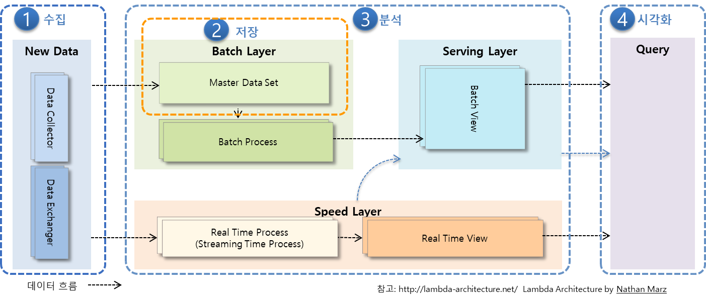

> 람다 아키텍처에 대한 솔루션 매핑 사례

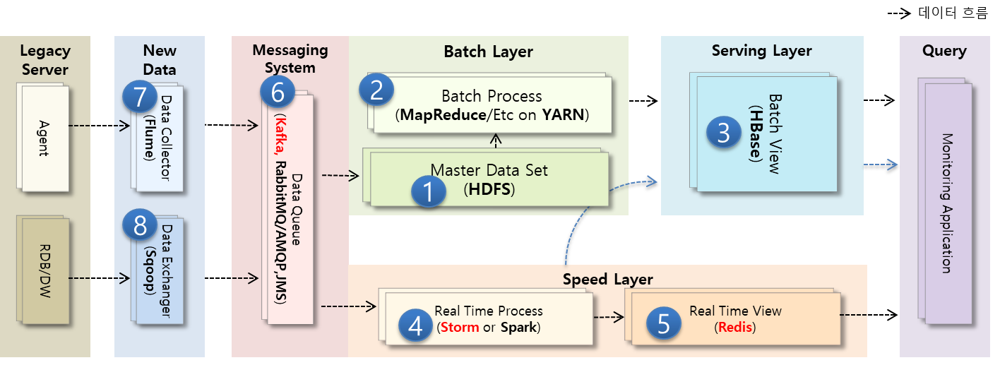

## Monitoring Architecture(Reference)

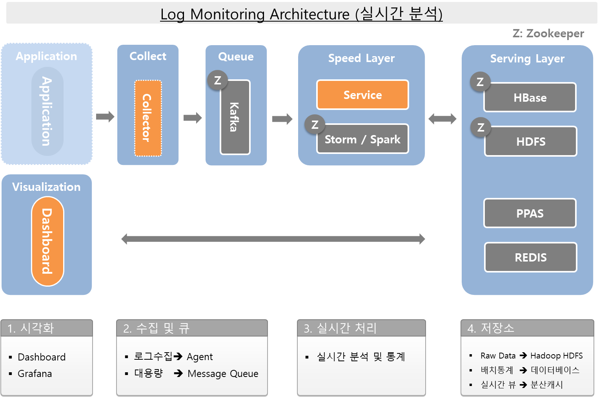

## Tech Stack

1. Distributed Platform: Hadoop
1. Data Store: HBase
1. Distribute Codinator: Zookeeper
1. Realtime Analysis: Storm or Spark
1. Visualization: Grafana
1. TSDB: InfluxDB
1. Collect: Telegraf
1. Message Queue: Kafka
1. In Memory Data Grid: Redis


### Other Hadoop-related projects at Apache include:

* Ambari
  +  A web-based tool for provisioning, managing, and monitoring Apache Hadoop clusters which includes support for Hadoop HDFS, Hadoop MapReduce, Hive, HCatalog, HBase, ZooKeeper, Oozie, Pig and Sqoop. Ambari also provides a dashboard for viewing cluster health such as heatmaps and ability to view MapReduce, Pig and Hive applications visually alongwith features to diagnose their performance characteristics in a user-friendly manner.
* Avro
  + A data serialization system
  + cf. Thrift, Protocol Buffers
* Hive
  + A data warehouse infrastructure that provides data summarization and ad hoc querying.
* Pig
  + A high-level data-flow language and execution framework for parallel computation.
* Spark
  + A fast and general compute engine for Hadoop data. Spark provides a simple and expressive programming model that supports a wide range of applications, including ETL, machine learning, stream processing, and graph computation.


# 2. 하둡 & HBase를 이용한 대용량 테이블 설계

## 2.1 Hadoop
> The Apache Hadoop software library is a framework that allows for the distributed processing of large data sets across clusters of computers using simple programming models.

* reliable, scalable, distributed computing

### HDFS(Hadoop Distributed File System)
> The Hadoop Distributed File System (HDFS) is a distributed file system designed to run on commodity hardware. 

#### Assumptions and Goals 

* Hardware Failure
* Streaming Data Access
  + Write Once, Read Any Number Of Times, But Don't Try To Change The Contents Of The File.
  + Throughput > Latency
* Large Data Sets
* Simple Coherency Model
* “Moving Computation is Cheaper than Moving Data”
* Potability Across Heterogeneous Hardware and Software Platforms

#### HDFS Architecture
Master-Slave architecture


#### NameNode 

* 파일 시스템의 네임스페이스를 관리
* 클라이언트의 파일 접근을 관리
* 파일 이름 변경, 파일과 디렉토리의 오픈/클로즈와 같은 파일 시스템 작업을 실행

#### DataNode

* 클라이언트의 요청을 읽어서 파일에 읽기/쓰기 작업
* 블럭의 생성, 삭제, 복제와 같은 작업을 수행

#### Block

* 여러 데이터 노드에 작은 파일로 나뉜다음 분산되어 저장 
* 블럭의 기본크기는 64MB, HDFS 설정에 따라서 바꿀 수 있음 

블럭을 보관할 노드의 선택

* 첫번째 복제는 원본과 같은 랙에 있는 노드를 선택
* 두번째와 세번째는 다른 랙에 보관

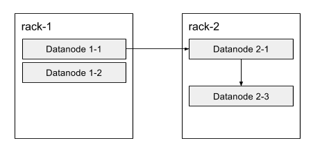

#### Operations

Action | Command
------ | -------
Create a directory named /foodir | bin/hadoop dfs -mkdir /foodir
Remove a directory named /foodir | bin/hadoop fs -rm -R /foodir
View the contents of a file named /foodir/myfile.txt | bin/hadoop dfs -cat /foodir/myfile.txt

### Hadoop 기본 포트

파라미터|기본값|용도|설정 파일|
-------|-----|----|---------|
 dfs.secondary.http.address	| 50090	| SecondaryNameNode 웹 서버 주소 및 포트 | hdfs-site.xml
 dfs.datanode.address	| 50010 |	DataNode 주소 및 포트 | hdfs-site.xml
 dfs.datanode.http.address | 50075 | DataNode 웹 서버 용 주소 및 포트 | hdfs-site.xml
 dfs.datanode.ipc.address	| 50020 |	DataNode ipc 서버용 주소 및 포트 | hdfs-site.xml
 dfs.http.address	| 50070 |	NameNode 웹 어드민용 주소 및 포트	| hdfs-site.xml
 mapred.job.tracker.http.address | 50030 | JobTracker 웹 서버용 주소 및 포트 | mapred-site.xml
 mapred.task.tracker.http.address |	50060 |	TaskTracker 웹 서버용 웹 주소 및 포트 |  mapred-site.xml 

### Apache Hadoop API

`pom.xml`
```xml
<dependency>
  <groupId>org.apache.hadoop</groupId>
  <artifactId>hadoop-client</artifactId>
  <version>2.7.1</version>
</dependency>
```

`HDFSClient.java`
```java
System.setProperty("HADOOP_USER_NAME", "vagrant");
UserGroupInformation ugi = UserGroupInformation.createRemoteUser("vagrant");

Configuration conf = new Configuration();
conf.set("fs.default.name", "hdfs://hadoop01:9000");

FileSystem dfs = FileSystem.get(conf);

System.out.println("Home Path : " + dfs.getHomeDirectory());
System.out.println("Work Path : " + dfs.getWorkingDirectory());

Path filenamePath = new Path("/tmp/hello.txt");
System.out.println("File Exists : " + dfs.exists(filenamePath));

if (dfs.exists(filenamePath)) {
  dfs.delete(filenamePath, true);
}

FSDataOutputStream out = dfs.create(filenamePath);
out.writeUTF("Hello, world!\n");
out.close();

FSDataInputStream in = dfs.open(filenamePath);
String messageIn = in.readUTF();
System.out.print(messageIn);

in.close();
dfs.close();
```

`실행결과`
```
[vagrant@hadoop03 ~]$ hadoop fs -ls /tmp
Found 1 items
-rw-r--r--   3 vagrant supergroup         16 2018-01-24 19:47 /tmp/hello.txt
[vagrant@hadoop03 ~]$ hadoop fs -cat /tmp/hello.txt
 Hello, world!
```

### Map & Reduce 

#### Apache Hadoop NextGen MapReduce (YARN)
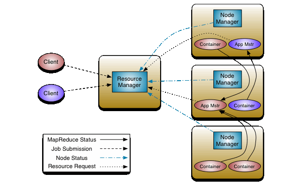

Functional Programming

Map
* Data Processing

Reduce
* Merge


## 2.2 HBase

> Apache HBase™ is the Hadoop database, a distributed, scalable, big data store.

* NoSQL
* Schemaless
* 가용성과 확장성
  + Region 서버만 추가하여 확장성 및 가용성 확보가 용이
  + 단, 특정 Region 서버에 부하가 집중되면 성능저하가 발생 -> 로우키 설계가 중요
* CAP: "분산 시스템에서는 다음의 3개 속성을 모두 가지는 것이 불가능하다"
  + Consistency (V)
  + **Availability**
  + Partitions Tolerance (V)
* Apache Phoenix: Add SQL Layer 

### Column Family

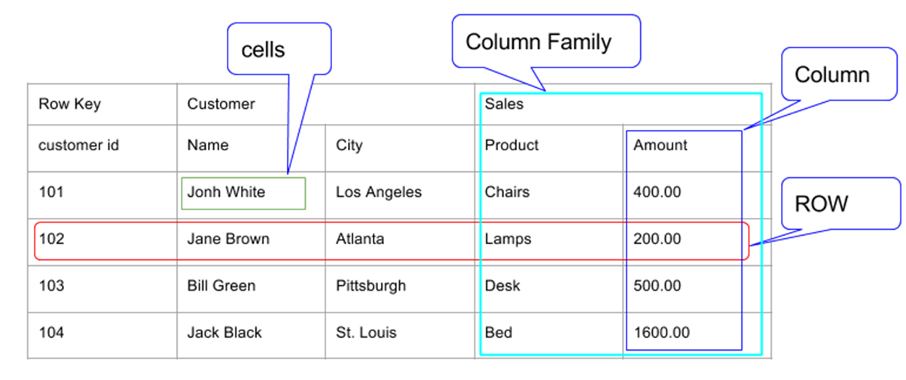

1. 이 테이블은 Customer와 Sales 두 개의 컬럼 패밀리를 가지고 있다.
1. Customer 컬럼 패밀리는 Name과 City 두 개의 컬럼을 가지고 있다.
1. Sales 컬럼 패밀리는 Product와 Amount 두 개의 컬럼을 가지고 있다.
1. Row는 Row Key, Customer CF, Sales CF로 구성된다.

### 특징

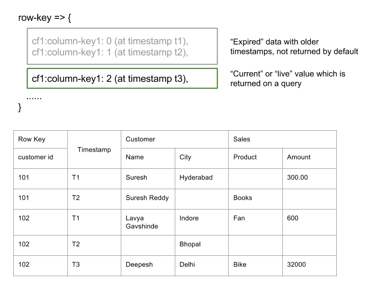

1. Sparse: HBase는 sparse matrix(희소행렬)방식으로 데이터를 저장 할 수 있다. 예컨데 굳이 모든 필드에 값을 채울 필요가 없다는 얘기다.
1. Column Oriented: RDBMS는 row 단위로 데이터를 저장한다. 하지만 HBase는 Sparse하기 때문에, 컬럼 단위로 데이터를 읽고 쓸 수 있다.
1. Distributed: 테이블은 수백만개의 Row와 컬럼들로 구성된다. 이들 컬럼들은 쉽게 분산 할 수 있다.
1. Versioned: 위 테이블은 Customer ID를 Row key로 사용하고 있다. 당연하지만 고객은 하나 이상의 물건을 구매할 수 있기 때문에 하나의 row key에 여러 개의 row를 저장 할 수 있다. 이 경우 Timestamp가 버전이 되며, 질의를 할 경우 가장 최근 timestamp의 row를 읽어 온다.
1. Non-relational: 관계형 데이터베이스의 ACID 속성을 따르지 않는다.

### Architecture

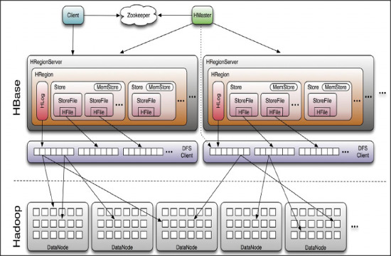

* HMaster
  + RegionServer 와 META 데이터 관리
* HRegionServer
  + Region 관리
* HResion
  + 테이블 데이터의 부분집합이며, 수평확장의 기본단위
* HLog
* HFile


### HBase HMaster
> 각 테이블의 데이터는 HRegionServer가 관리하며, 전체 클러스터는 HMaster가 관리한다.

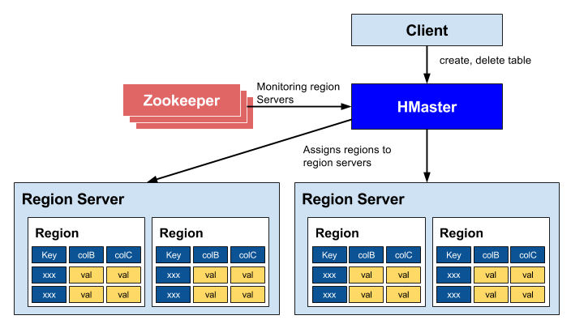

* 리전 서버들을 조정
  + 리전의 시작을 관리
  + 클러스터에 있는 모든 리전 서버들을 모니터링 
* 관리 기능
  + 테이블의 생성, 삭제, 업데이트

### HBase Catalog Tables

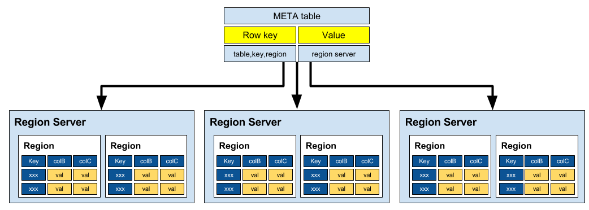

* META 테이블
  + 클러스터에 포함된 리전의 위치정보들을 저장

### Region Server Components 

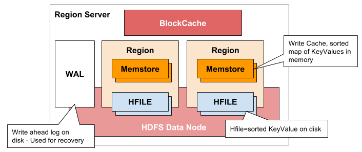

* WAL(Write Ahead Log)
  + 데이터 저장 실패를 복구하기 위해서 사용
* BlockCache 
  + 읽기 캐시
* MemStore
  + 쓰기 캐시
  + 각 리전의 컬럼 패밀리당 하나
* HFile

### HBASE vs RDBMS

HBase | RDBMS
----- | -----
스키마가 없다. column families만으로 이용 | 테이블의 구조를 기술하는 스키마
수평적으로 확장성이 있어 큰 테이블에 적합 | 확장하기 어려우며, 크기가 작은 테이블을 위해 생성
Transaction이 존재하지 않음 | Transaction이 존재
비 일반화된 데이터 | 일반화된 데이터
덜 구조화된 데이터가 적합 | 구조화된 데이터에 적합
get / put / scan 등 | SQL
MapReduce Join 활용 | Join에 최적화 됨
RowKey만 인덱스 지원 | 임의 컬럼에 대한 인덱스 지원
초당 수십만건 Read/Write | 초당 수천건 Read/Write
단일로우 트랜잭션 보장 | 다중 로우 트랜잭션 보장

### HBase 사용법 

#### 1. Connect to HBase

```
$ ./bin/hbase shell
hbase(main):001:0>
```

#### 2. Create a table 

```
hbase(main):001:0> create 'test', 'cf'
0 row(s) in 0.4170 seconds

=> Hbase::Table - test
```

#### 3. List Information About your Table

```
hbase(main):002:0> list 'test'
TABLE
test
1 row(s) in 0.0180 seconds

=> ["test"]
```

#### 4. Put data into your table.

```
hbase(main):003:0> put 'test', 'row1', 'cf:a', 'value1'
0 row(s) in 0.0850 seconds

hbase(main):004:0> put 'test', 'row2', 'cf:b', 'value2'
0 row(s) in 0.0110 seconds

hbase(main):005:0> put 'test', 'row3', 'cf:c', 'value3'
0 row(s) in 0.0100 seconds
```

#### 5. Scan the table for all data at once.

```
hbase(main):006:0> scan 'test'
ROW                                      COLUMN+CELL
 row1                                    column=cf:a, timestamp=1421762485768, value=value1
 row2                                    column=cf:b, timestamp=1421762491785, value=value2
 row3                                    column=cf:c, timestamp=1421762496210, value=value3
3 row(s) in 0.0230 seconds
```

#### 6. Get a single row of data.

```
hbase(main):007:0> get 'test', 'row1'
COLUMN                                   CELL
 cf:a                                    timestamp=1421762485768, value=value1
1 row(s) in 0.0350 seconds
```

#### 7. Disable a table.

```
hbase(main):008:0> disable 'test'
0 row(s) in 1.1820 seconds

hbase(main):009:0> enable 'test'
0 row(s) in 0.1770 seconds
```

#### 8. Drop the table.

```
hbase(main):011:0> drop 'test'
0 row(s) in 0.1370 seconds
```

#### 9. Exit the HBase Shell.

```
hbase(main):006:0> quit 
```


### HBase Java Client Example

`HBase Data Structure`
```
Family1:{  
   'Qualifier1':'row1:cell_data',
   'Qualifier2':'row2:cell_data',
   'Qualifier3':'row3:cell_data'
}
Family2:{  
   'Qualifier1':'row1:cell_data',
   'Qualifier2':'row2:cell_data',
   'Qualifier3':'row3:cell_data'
}
```

`HBase Client Maven Dependency`
```xml
<dependency>
  <groupId>org.apache.hbase</groupId>
  <artifactId>hbase-client</artifactId>
  <version>${hbase.version}</version>
</dependency>
<dependency>
  <groupId>org.apache.hbase</groupId>
  <artifactId>hbase</artifactId>
  <version>${hbase.version}</version>
  <type>pom</type>
</dependency>
```

#### 1. Connecting to HBase

`hbase-site.xml`
```xml
<configuration>
  <property>
    <name>hbase.zookeeper.quorum</name>
    <value>hadoop01</value>
  </property>
  <property>
    <name>hbase.zookeeper.property.clientPort</name>
    <value>2181</value>
  </property>
</configuration>
```

```java
Configuration config = HBaseConfiguration.create();
 
String path = this.getClass()
  .getClassLoader()
  .getResource("hbase-site.xml")
  .getPath();
config.addResource(new Path(path));

HBaseAdmin.checkHBaseAvailable(config);
```

#### 2. Createing a Database Structure 

```java
private TableName table1 = TableName.valueOf("Table1");
private String family1 = "Family1";
private String family2 = "Family2";
```

```java
Connection connection = ConnectionFactory.createConnection(config)
Admin admin = connection.getAdmin();
```

```java
HTableDescriptor desc = new HTableDescriptor(table1);
desc.addFamily(new HColumnDescriptor(family1));
desc.addFamily(new HColumnDescriptor(family2));
admin.createTable(desc);
```

#### 3. Adding and Retrieving Elements 

```java
byte[] row1 = Bytes.toBytes("row1")
Put p = new Put(row1);
p.addImmutable(family1.getBytes(), qualifier1, Bytes.toBytes("cell_data"));
table1.put(p);
```

```java
Get g = new Get(row1);
Result r = table1.get(g);
byte[] value = r.getValue(family1.getBytes(), qualifier1);
```

```java
Bytes.bytesToString(value)
```

#### 4. Scanning and Filtering 

```java
Filter filter1 = new PrefixFilter(row1);
Filter filter2 = new QualifierFilter(
  CompareOp.GREATER_OR_EQUAL, 
  new BinaryComparator(qualifier1));
List<Filter> filters = Arrays.asList(filter1, filter2);
```

```java
Scan scan = new Scan();
scan.setFilter(new FilterList(Operator.MUST_PASS_ALL, filters));
scan.addColumn(family1.getBytes(), qualifier1);
 
ResultScanner scanner = table.getScanner(scan);
for (Result result : scanner) {
    System.out.println("Found row: " + result);
}
```

#### 5. Deleting Rows 

```java
Delete delete = new Delete(row1);
delete.addColumn(family1.getBytes(), qualifier1);
table.delete(delete);
```

### Apache Phoenix
> Phoenix is an open source SQL skin for HBase.  
> You use the standard JDBC APIs instead of the regular HBase client APIs to create tables, insert data, and query your HBase data.

#### 특징
* HBase 데이터에 대한 빠른 접근이 가능
  + MapReduce를 사용하지 않고 SQL 쿼리를 Native HBase 명령어로 컴파일하여 수행
* 추가적인 서버가 필요하지 않기 때문에 비교적 가벼움
* 기존에 존재하는 HBase 테이블과의 매핑이 가능

#### 장점
* JOIN
* Paging
  + OFFSET & LIMIT (ex. LIMIT 10 OFFSET 10)
* Secondary Index
* Salted Tables
  + Splitting: pre-split on salt bytes boundaries
    - ex. new_row_key = (++index % BUCKETS_NUMBER) + original_key
	
  + Row Key Ordering: phoenix.query.rowKeyOrderSaltedTable=true
  + CREATE TABLE table (a_key VARCHAR PRIMARY KEY, a_col VARCHAR) SALT_BUCKETS = 20;

### Apache Phoenix Java Client Example

`Phoenix Driver Maven Dependency`
```xml
<dependency>
  <groupId>org.apache.phoenix</groupId>
  <artifactId>phoenix-core</artifactId>
  <version>4.13.1-HBase-1.2</version>
</dependency>
```

`PhoenixExample.java`
```java
public class PhoenixExample {

	public static void main(String[] args) {
		// Create variables
		Connection connection = null;
		Statement statement = null;
		ResultSet rs = null;
		PreparedStatement ps = null;

		try {
			connection = DriverManager.getConnection("jdbc:phoenix:demo");
			statement = connection.createStatement();
			statement.executeUpdate("create table javatest (mykey integer not null primary key, mycolumn varchar)");
			statement.executeUpdate("upsert into javatest values (1,'Hello')");
			statement.executeUpdate("upsert into javatest values (2,'Java Application')");
			connection.commit();

			ps = connection.prepareStatement("select * from javatest");
			rs = ps.executeQuery();

			System.out.println("Table Values");
			while (rs.next()) {
				Integer myKey = rs.getInt(1);
				String myColumn = rs.getString(2);
				System.out.println("\tRow: " + myKey + " = " + myColumn);
			}
		} catch (SQLException e) {
			e.printStackTrace();
		} finally {
			try {
				ps.close();
				rs.close();
				statement.close();
				connection.close();
			} catch (Exception e) {
			}
		}
	}
}
```


## 2.3 ZooKeeper

> A Distributed Coordination Service for Distributed Applications

* 설정 정보 관리
* 노드 리스트 관리
* 리더선정

### ZooKeeper Architecture


### Desigh Goals

* ZooKeeper is simple.
  + ZooKeeper allows distributed processes to coordinate with each other through a shared hierarchal namespace which is organized similarly to a standard file system.
* Zookeeper is replicated.
  + ZooKeeper itself is intended to be replicated over a sets of hosts called an ensemble.
* Zookeeper is ordered.
  + ZooKeeper stamps each update with a number that reflects the order of all ZooKeeper transactions.
* Zookeeper is fast.
  + It is especially fast in "read-dominant" workloads.

### Simple API

operation | desc
--------- | ----
create | creates a node at a location in the tree
delete | deletes a node
exists | tests if a node exists at a location
get data | reads the data from a node
set data | writes data to a node
get children | retrieves a list of children of a node
sync | waits for data to be propagated


### Programming to ZooKeeper


# 3. Storm 을 이용한 실시간 데이터 분석

> Apache Storm is a free and open source distributed realtime computation system.

## 데이타 스트림과 실시간 분석 

* 시간을 축으로 하여 계속해서 생성되는 데이터
* 배치 분석 vs. 실시간 분석
* 마케팅과 같이 실시간 대응이 중요한 경우에는 **데이터 스트림**을 **실시간** 으로 분석
* EX> 이벤트 감지를 통한 이상 거래 탐지(Fraud Detection) 

## Storm 특징

* Integrates
  + Storm integrates with any queueing system and any database system. 
* Simple API
* Scalable
  + Storm was benchmarked at processing one million 100 byte messages per second per node on hardware with the following specs:
    - Processor: 2x Intel E5645@2.4Ghz
    - Memory: 24 GB
* Fault tolerant
* Guarantees data processing
  + Using Trident, a higher level abstraction over Storm's basic abstractions, you can achieve exactly-once processing semantics.
* Use with any language
* Easy to deploy and operate
* Free and open source  
  + Apache Storm is a free and open source project licensed under the Apache License, Version 2.0

## Storm Architecture

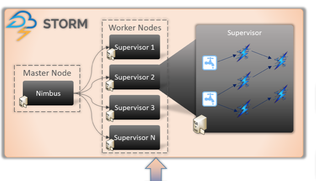

1. Nimbus -> Master Node
1. Supervisor -> Worker Node

## Storm Components

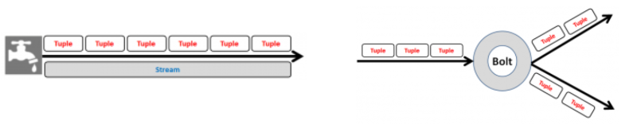

1. Spout: Spout is the entry point in a storm topology.
1. Bolt: Bolt contains the actual processing logic.
1. Topology: Topology is a network of spouts and bolts
1. Stream: A stream is an unbounded sequence of tuples
1. Tuple: Tuple is the most basic data structure in storm . Its a named list of values.

## Storm Parallelism 

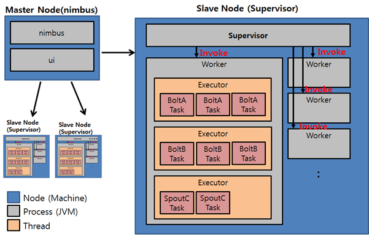

* Node
  + Nimbus나 Supervisor 프로세스가 기동되는 물리적인 서버
* Worker
  + Supervisor가 있는 노드에서 기동되는 자바 프로세스
* Executor
  + Worker내에서 수행되는 자바 쓰레드
* Task
  + Bolt 및 Spout 객체

## Storm Example

### 1. HelloTopology Example

`pom.xml`
```xml
<dependency>
  <groupId>org.apache.storm</groupId>
  <artifactId>storm-core</artifactId>
  <version>1.1.1</version>
  <scope>provided</scope>
</dependency>
```

`HelloSpout.java`
```java
public class HelloSpout extends BaseRichSpout {
	private SpoutOutputCollector collector;

	public void open(Map conf, TopologyContext context, SpoutOutputCollector collector) {
		this.collector = collector;
	}

	public void nextTuple() {
		this.collector.emit(new Values("Hello World!"));
	}

	public void declareOutputFields(OutputFieldsDeclarer declarer) {
		declarer.declare(new Fields("say"));
	}
}
```

`HelloBolt.java`
```java
public class HelloBolt extends BaseBasicBolt {
	
	private static final long serialVersionUID = 1L;

	public void execute(Tuple tuple, BasicOutputCollector collector) {
		String value = tuple.getStringByField("say");
		System.out.println("Tuple value is " + value);
	}

	public void declareOutputFields(OutputFieldsDeclarer declarer) {
	}
}
```

`HelloTopology.java`
```java
public class HelloTopology {
	public static void main(String args[]) throws Exception {
		TopologyBuilder builder = new TopologyBuilder();
		builder.setSpout("HelloSpout", new HelloSpout(), 2);
		builder.setBolt("HelloBolt", new HelloBolt(), 4).shuffleGrouping("HelloSpout");

		Config conf = new Config();
		conf.setDebug(true);

		// If there are arguments, we are running on a cluster
		if (args != null && args.length > 0) {
			// parallelism hint to set the number of workers
			conf.setNumWorkers(3);
			// submit the topology
			StormSubmitter.submitTopology(args[0], conf, builder.createTopology());
		}
		// Otherwise, we are running locally
		else {
			LocalCluster cluster = new LocalCluster();

			cluster.submitTopology("HelloTopologyLocal", conf, builder.createTopology());
			Utils.sleep(10000);

			// kill the LearningStormTopology
			cluster.killTopology("HelloTopologyLocal");
			// shutdown the storm test cluster
			cluster.shutdown();
		}
	}
}
```

### 2. 빌드 및 배포

```
$ mvn clean package -DskipTests=true
```

```
$ storm jar storm-0.0.1-SNAPSHOT.jar hello.HelloTopology HelloTopology
```


# 4. Kafka 및 Redis 활용

## 4.1 Kafka

> A distributed streaming platform

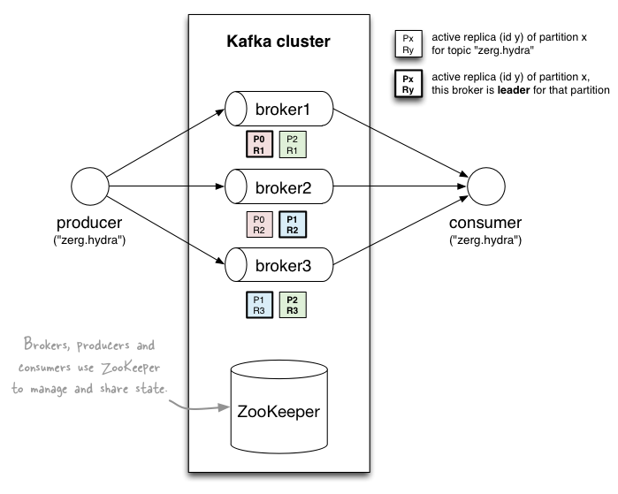

### First a few concepts:

* Kafka is run as a cluster on one or more servers.
* The Kafka cluster stores streams of records in categories called topics.
* Each record consists of a key, a value, and a timestamp.

### Topics and Logs 


### Producers

### Consumers


## 4.2 Kafka-Storm Example

`pom.xml`
```xml
<dependency>
  <groupId>org.apache.storm</groupId>
  <artifactId>storm-core</artifactId>
  <version>1.1.1</version>
  <scope>provided</scope>
</dependency>
```

`CutLogBolt.java`
```java
public class CutLogBolt extends BaseBasicBolt {

	private static final long serialVersionUID = 1L;

	@Override
	public void execute(Tuple input, BasicOutputCollector collector) {

		String[] splitArray = input.getString(0).split(";");
		String key = "";
		String doctype = "";

		for (int i = 0; i < splitArray.length; i++) {
			if (splitArray[i].contains("key"))
				key = splitArray[i];
			if (splitArray[i].contains("doctype"))
				doctype = splitArray[i];
		}
		collector.emit(new Values(key, doctype));
	}

	@Override
	public void declareOutputFields(OutputFieldsDeclarer declarer) {
		declarer.declare(new Fields("key", "doctype"));
	}
}
```

`ClassifyKeyBolt.java`
```java
public class ClassifyKeyBolt extends BaseBasicBolt {

	private static final long serialVersionUID = 1L;

	@Override
	public void execute(Tuple input, BasicOutputCollector collector) {
		String[] splitdoctype = input.getStringByField("doctype").split(":");
		String[] splitkey = input.getStringByField("key").split(":");
		if (splitkey.length == 2 && splitdoctype.length == 2) {
			String doctype = splitdoctype[1].trim();
			String key = splitkey[1].trim();
			// System.err.println(key + ":" + doctype);
			collector.emit(new Values(key + ":" + doctype));
		}
	}

	@Override
	public void declareOutputFields(OutputFieldsDeclarer declarer) {
		declarer.declare(new Fields("subdoctype"));
	}
}
```

`DoctypeCountBolt.java`
```java
public class DoctypeCountBolt extends BaseBasicBolt {

	private static final long serialVersionUID = 1L;

	Map<String, Integer> docMap = new HashMap<String, Integer>();

	@Override
	public void execute(Tuple input, BasicOutputCollector collector) {

		String doctype = input.getStringByField("subdoctype");

		Integer count = docMap.get(doctype);
		if (count == null)
			count = 0;

		count++;

		docMap.put(doctype, count);
		System.out.println(docMap);
		collector.emit(new Values(docMap));
	}

	@Override
	public void declareOutputFields(OutputFieldsDeclarer declarer) {
		declarer.declare(new Fields("docmap"));
	}
}
```

`MonitorTopology.java`
```java
public class MonitorTopology {

	public static void main(String[] args) throws Exception {

		String zkUrl = "demo:2181";
		String brokerUrl = "demo:9092";

		System.out.println("Using Kafka zookeeper url: " + zkUrl + " broker url: " + brokerUrl);

		ZkHosts hosts = new ZkHosts(zkUrl);

		SpoutConfig spoutConfig = new SpoutConfig(hosts, "onlytest", "/onlytest", UUID.randomUUID().toString());
		spoutConfig.scheme = new SchemeAsMultiScheme(new StringScheme());
		KafkaSpout kafkaSpout = new KafkaSpout(spoutConfig);

		TopologyBuilder builder = new TopologyBuilder();
		builder.setSpout("spout", kafkaSpout, 1);
		builder.setBolt("cutbolt", new CutLogBolt(), 2).shuffleGrouping("spout");
		builder.setBolt("classifybolt", new ClassifyKeyBolt(), 2).fieldsGrouping("cutbolt", new Fields("key", "doctype"));
		builder.setBolt("docbolt", new DoctypeCountBolt(), 2).fieldsGrouping("classifybolt", new Fields("subdoctype"));

		Config conf = new Config();
		conf.setDebug(true);

		List<String> nimbus_seeds = new ArrayList<String>();
		nimbus_seeds.add("nimbus url");
		if (args != null && args.length > 0) {
			conf.setNumWorkers(3);
			StormSubmitter.submitTopologyWithProgressBar(args[0], conf, builder.createTopology());
		} else {
			conf.setNumWorkers(3);
			StormSubmitter.submitTopology("onlytest", conf, builder.createTopology());
		}
	}
}
```

빌드 및 배포
```
$ mvn clean package -DskipTests=true
$ storm jar storm-0.0.1-SNAPSHOT.jar monitor.MonitorTopology MonitorTopology
```


## 4.2 Redis(Remote Dictionary Server)

> Redis is an open source (BSD licensed), **in-memory data structure store**, used as a database, **cache** and message broker

### 특징

* key-value data store
* value can be a string, list, set, sorted set or hash

### Redis Java Example

`pom.xml`
```xml
<dependency>
    <groupId>redis.clients</groupId>
    <artifactId>jedis</artifactId>
    <version>2.9.0</version>
</dependency>
```

`HelloRedis.java`
```java
public class HelloRedis {
	public static void main(String args[]) {
		JedisPool jedisPool = new JedisPool(new JedisPoolConfig(), "192.168.33.10");
		Jedis jedis = jedisPool.getResource();

		try {
			jedis.set("test1", "testValue1");
			jedis.set("test2", "testValue2");
			System.out.println("jedis Value 1 : " + jedis.get("test1"));
			System.out.println("jedis Value 2 : " + jedis.get("test2"));
			System.out.println(jedis.dbSize());
		} catch (JedisConnectionException e) {
		} finally {
			if (null != jedis) {
				jedisPool.close();
			}
		}

		jedisPool.destroy();
	}
}
```


# 5. Grafana 와 InfluxDB를 이용한 대시보드 구성

## Dashboard Architecture


[출처링크] http://www.popit.kr/influxdb_telegraf_grafana_2/

## Grafana

> The open platform for beautiful analytics and monitoring  
> The leading open source software for the time series analytics

## InfluxDB

> InfluxDB is a Time Series Database built from the ground up to handle high write & query loads.

## Telegraf

> Telegraf is the Agent for Collecting & Reporting Metrics & Data 


# Reference 

* [Vagrant Getting Started](https://www.vagrantup.com/intro/getting-started/index.html)

* [MapReduce Tutorial](https://hadoop.apache.org/docs/r2.7.1/hadoop-mapreduce-client/hadoop-mapreduce-client-core/MapReduceTutorial.html#MapReduce_Tutorial)

* [Apache HBase Reference Guild](http://hbase.apache.org/book.html)

* [Apache Storm Documentation, Version: 1.1.1][storm]

[storm]: http://storm.apache.org/releases/1.1.1/index.html "Apache Storm"

* [Apache Storm을 이용한 실시간 데이터 처리](http://bcho.tistory.com/989?category=563141)

* [Spring Data Redis][redis]

[redis]: https://projects.spring.io/spring-data-redis/#quick-start "Spring Data Redis"

* <http://lambda-architecture.net/>

* [Zookeeper Overview](https://zookeeper.apache.org/doc/current/zookeeperOver.html)

* [HBase with Java](http://www.baeldung.com/hbase)

* [Apache Kafka Introduction](http://kafka.apache.org/intro)